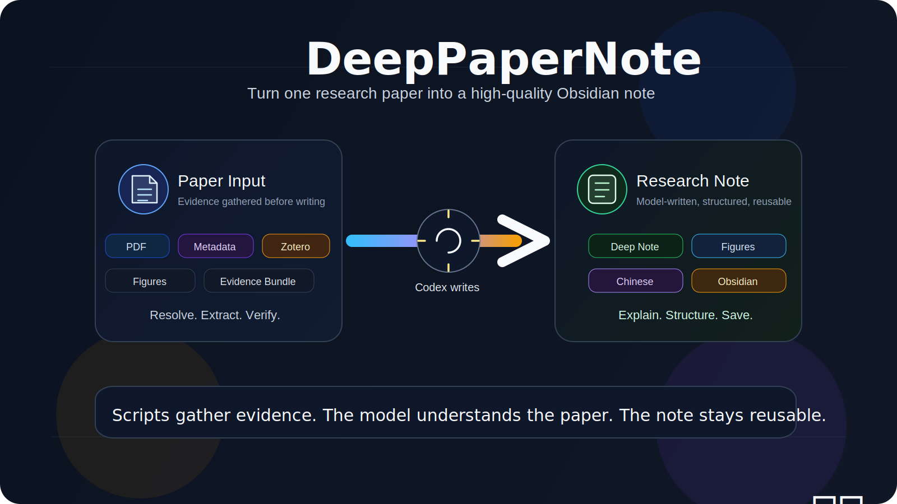

<div align="center">

# DeepPaperNote

**Turn one research paper into a high-quality Obsidian note you would actually keep.**

[English](./README.md) | [简体中文](./README.zh-CN.md)

[](https://github.com/917Dhj/DeepPaperNote)
[](https://github.com/917Dhj/DeepPaperNote/releases/tag/v0.1.0-alpha)
[](./LICENSE)
[](./SKILL.md)
[](./references/obsidian-format.md)
[](./references/figure-placement.md)
[](./references/model-synthesis.md)
[](./CHANGELOG.md)

</div>



DeepPaperNote is a **Codex skill** for a very specific workflow:

- read one paper carefully
- gather evidence from PDF, metadata sources, and optionally Zotero
- let the language model do the real interpretation
- write a polished Markdown note into an Obsidian vault when available, or into the current workspace as a fallback

It is built for people who want something better than an abstract rewrite.

## Quick Start

1. Put this repository in your Codex skills directory:

   ```text
   ~/.codex/skills/DeepPaperNote
   ```

2. Restart Codex.

3. Trigger the skill with a paper title, DOI, arXiv ID, URL, Zotero item, or local PDF.

Typical prompts:

- `给这篇论文生成深度笔记`
- `把这篇文章整理成 obsidian 笔记`
- `读这篇论文并生成 md 笔记`

4. DeepPaperNote will:
   - resolve the paper identity
   - gather metadata and PDF evidence
   - build a synthesis bundle
   - let Codex/GPT write the final note
   - lint the note before saving it
   - save it into Obsidian when configured, or into the current workspace as a fallback

If you want the Python dependencies for local development:

```bash
python3 -m pip install -e .
```

After installation, you can also ask Codex with short prompts such as:

- `/deeppapernote doctor`
- `/deeppapernote start`
- `查看 deeppapernote 的可用情况`
- `deeppapernote 有什么功能`

In that mode, DeepPaperNote should explain its capabilities, inspect the current setup, and tell you what is already configured or still missing.

If you want a more explicit onboarding prompt, see [ONBOARDING_PROMPT.md](./ONBOARDING_PROMPT.md).

## 🔧 Configuration

DeepPaperNote can be tried with zero configuration.

- if no Obsidian vault is configured, it can still save notes into the current workspace
- if you want Obsidian-native note management, you should configure your vault path
- everything else in this section is optional and improves specific workflows

### Required: Tell DeepPaperNote where your Obsidian vault is

DeepPaperNote writes notes into an Obsidian vault.
The cleanest way to configure that is with an environment variable:

```bash
export DEEPPAPERNOTE_OBSIDIAN_VAULT="/absolute/path/to/your/Obsidian_Documents"
```

Optional related settings:

```bash
export DEEPPAPERNOTE_PAPERS_DIR="20_Research/Papers"
export DEEPPAPERNOTE_OUTPUT_DIR="tmp/DeepPaperNote"
```

What they do:

| Variable | Required | Purpose |
| --- | --- | --- |
| `DEEPPAPERNOTE_OBSIDIAN_VAULT` | Yes for normal vault writes | Root path of your Obsidian vault |
| `DEEPPAPERNOTE_PAPERS_DIR` | Optional | Vault-relative paper output folder, default: `20_Research/Papers` |
| `DEEPPAPERNOTE_OUTPUT_DIR` | Optional | Local temporary artifact directory, default: `tmp/DeepPaperNote` |
| `DEEPPAPERNOTE_WORKSPACE_OUTPUT_DIR` | Optional | Fallback output folder under the current working directory when no Obsidian vault is configured, default: `DeepPaperNote_output` |

If no Obsidian vault is configured, DeepPaperNote can still save notes under the current working directory instead of failing outright.
That fallback is useful for quick trials, but it is not the recommended long-term note-management workflow.

Why the optional path settings can help:

- `DEEPPAPERNOTE_PAPERS_DIR`
  Useful if your vault does not store papers under `20_Research/Papers`, or if you want DeepPaperNote to fit an existing folder convention without extra manual moves.
- `DEEPPAPERNOTE_OUTPUT_DIR`
  Useful if you want all intermediate artifacts in a predictable location for debugging, cleanup, or experimentation.

### Optional: Zotero MCP for local-library-first workflows

DeepPaperNote can work without Zotero.
But if you want Codex to search your local Zotero library first, you should configure a Zotero MCP option that Codex can actually use.

This is most worth setting up if you already use Zotero as your main paper-management or reading workflow.

Recommended ways to think about it:

| Option | Best for | Notes |
| --- | --- | --- |
| [kujenga/zotero-mcp](https://github.com/kujenga/zotero-mcp) | Lightweight read access | Closer to a minimal Zotero MCP server for search, metadata, and text access |
| [54yyyu/zotero-mcp](https://github.com/54yyyu/zotero-mcp) | Richer research workflow features | More feature-rich, but depending on your Codex setup it may require extra adaptation rather than working out of the box |

Why it matters:

- local Zotero hits are usually the best identity anchor
- Codex can prefer your local paper library before internet search
- local attachments can reduce wrong-title matches
- it is especially helpful when you already curate papers in Zotero and do not want DeepPaperNote to rediscover the same paper from weaker web matches
- it also improves reliability for published papers whose title may collide with preprints, workshop versions, or mirrored pages

Important note:

- DeepPaperNote does **not** require one specific Zotero MCP implementation
- for DeepPaperNote, the key capability is that Codex can search Zotero items, inspect metadata, and ideally read local full text
- some Zotero MCP projects were built with other agent clients in mind, so using them with Codex may require extra adaptation

### Optional: Semantic Scholar API key

This is not required, but if you have a Semantic Scholar API key you can expose it as:

```bash
export DEEPPAPERNOTE_SEMANTIC_SCHOLAR_API_KEY="your_api_key"
```

Why it can help:

- metadata lookup is usually more stable when Semantic Scholar is available
- title-based paper resolution can be more reliable for hard-to-match papers
- author, venue, and abstract backfill may be more complete in some cases
- it gives DeepPaperNote one more strong source before falling back to weaker guesses

### Optional: OCR tooling for scanned PDFs

OCR is not required for many modern PDFs.
But it becomes useful when a paper is:

- a scanned PDF
- an image-based PDF with poor embedded text
- an older paper where direct text extraction is incomplete

Why DeepPaperNote uses OCR:

- to recover page text when direct PDF extraction is too weak
- to preserve method and results evidence that would otherwise be lost
- to improve page-level context around figures and captions

Current OCR logic in DeepPaperNote:

- DeepPaperNote first tries normal PDF text extraction with `PyMuPDF`
- for each page, it counts how much searchable text was extracted
- if a page has too little extracted text, it becomes an OCR fallback candidate
- OCR is then applied to that page only
- the recovered OCR text is mainly used as page context for later evidence handling and figure/page semantic matching

Important scope note:

- OCR is currently a **page-text fallback**
- it is **not** the primary extraction path for all PDFs
- it is **not** used as a replacement for model-side understanding
- it is **not** used to "understand images" directly

Without OCR, DeepPaperNote still works well on normal digital PDFs, but scanned or low-quality PDFs may produce weaker evidence.

Required software and packages for OCR:

| Layer | Requirement | Purpose |
| --- | --- | --- |
| System tool | `tesseract` | The actual OCR engine |
| Python package | `pytesseract` | Python bridge to `tesseract` |
| Python package | `Pillow` | Opens rendered page images before OCR |
| Existing PDF layer | `PyMuPDF` | Renders pages and extracts normal PDF text |

Install on macOS:

```bash
brew install tesseract
python3 -m pip install --user pytesseract Pillow
```

Quick verification:

```bash
tesseract --version
python3 -c "import pytesseract, PIL; print('python_ok')"
python3 -c "import pytesseract; print(pytesseract.get_tesseract_version())"
```

## 📝 Changelog Preview

For release-level updates, see [CHANGELOG.md](./CHANGELOG.md).

| Version | Status | Highlights |
| --- | --- | --- |
| Unreleased | In progress | Initial public Codex workflow, synthesis bundle pipeline, Zotero-first helpers, placeholder-first figure planning |

## Why DeepPaperNote

Most paper-summary workflows stop too early:

- they overfit to the abstract
- they flatten technical details into generic bullets
- they silently skip figures when extraction is messy
- they produce notes that look neat but are not useful a week later

DeepPaperNote takes a different stance:

- `scripts` gather, normalize, and verify evidence
- Codex/GPT does the actual understanding and writing
- figure handling is `placeholder-first`
- text correctness matters more than image completeness

The goal is not "summarize a paper".
The goal is "produce a note you would actually keep in a serious research vault".

## ✨ What Makes It Different

| Feature | What it means in practice |
| --- | --- |
| Model-first understanding | Scripts do deterministic work and do **not** pretend to understand the paper better than the model. |
| Deep-reading notes | The note should reconstruct the paper's argument, not paraphrase the abstract. |
| Figure placeholder-first | Major figures and tables should stay in the note structure even when extraction is partial. |
| Obsidian-native output | Each paper gets its own folder with a note file and local `images/` directory. |
| Zotero-first | If the paper exists in local Zotero, use that as the most reliable identity anchor first. |

## ⚙️ How It Works

The default workflow is:

1. resolve the paper identity
2. collect metadata
3. acquire the PDF or strong full-text evidence
4. extract evidence
5. extract PDF image assets
6. plan figure placement
7. build a synthesis bundle
8. let Codex/GPT write the note
9. lint the final note
10. write it into Obsidian

Core principle:

- scripts gather evidence
- the model writes
- lint guards quality before save

See also:

- [Workflow](./references/workflow.md)
- [Architecture](./references/architecture.md)
- [Model Synthesis](./references/model-synthesis.md)

## 🖼️ Figure Strategy

DeepPaperNote uses a placeholder-first strategy.

If a major figure matters, the note should preserve it even when extraction is imperfect.

Preferred placeholder format:

```md
> [!figure] Fig. 3 数据分布与质量评估
> 建议位置：数据与任务定义
> 放置原因：这张图同时展示样本构成、对话长度统计和专家质检结果，是理解 `PsyInterview` 数据边界最重要的图之一。
> 当前状态：保留占位；当前提取结果只拿到局部子图，无法稳定恢复成可独立解释的完整原图。
```

Rule of thumb:

- figures may be partial
- figures may be missing
- text must stay accurate

See [Figure Placement](./references/figure-placement.md).

## ✅ Quality Bar

DeepPaperNote is strict about what counts as a successful note.

The note should:

- distinguish research problem from task definition
- explain the real method or analysis flow
- include key numbers that actually matter
- point out what is easy to misread
- state at least one honest limitation
- use real heading levels: `#`, `##`, `###`
- avoid half-Chinese half-English prose lines

If evidence quality is too weak, the skill should fail closed or clearly degrade the output, not pretend it performed a true deep read.

See:

- [Evidence First](./references/evidence-first.md)
- [Deep Analysis](./references/deep-analysis.md)
- [Final Writing](./references/final-writing.md)
- [Note Quality](./references/note-quality.md)

## 🗂️ Repository Layout

```text
DeepPaperNote/
├── SKILL.md
├── README.md
├── README.zh-CN.md
├── agents/
│   └── openai.yaml
├── assets/
│   ├── hero.png
│   ├── hero.svg
│   └── note_template.md
├── references/
│   ├── architecture.md
│   ├── deep-analysis.md
│   ├── evidence-first.md
│   ├── figure-placement.md
│   ├── final-writing.md
│   ├── metadata-sources.md
│   ├── model-synthesis.md
│   ├── note-quality.md
│   ├── obsidian-format.md
│   ├── paper-types.md
│   └── workflow.md
└── scripts/
    ├── build_synthesis_bundle.py
    ├── collect_metadata.py
    ├── common.py
    ├── contracts.py
    ├── create_input_record.py
    ├── extract_evidence.py
    ├── extract_pdf_assets.py
    ├── fetch_pdf.py
    ├── lint_note.py
    ├── locate_zotero_attachment.py
    ├── materialize_figure_asset.py
    ├── plan_figures.py
    ├── resolve_paper.py
    ├── run_pipeline.py
    └── write_obsidian_note.py
```

## 🧰 Recommended Environment

| Component | Status | Notes |
| --- | --- | --- |
| Codex desktop / CLI | Recommended | Primary target environment |
| Python 3.10+ | Required | Runs the helper scripts |
| Obsidian vault | Required for note writing | Configure `DEEPPAPERNOTE_OBSIDIAN_VAULT` |
| Zotero + MCP | Optional | Best for local-library-first workflows |
| OCR tooling | Optional | Helpful for scanned PDFs |

## 📌 Current Status

This repository is in active early-stage development.

| Area | Current state |
| --- | --- |
| Single-paper preprocessing pipeline | ✅ Working |
| Synthesis bundle generation | ✅ Working |
| Zotero-first helper workflow | ✅ Working |
| Obsidian writing flow | ✅ Working |
| Placeholder-first figure planning | ✅ Working |
| Style and structure linting | ✅ Working |
| Public examples | Not added yet |
| Test suite | ✅ Minimal suite added |
| CI | ✅ GitHub Actions configured |
| Packaging metadata | Not added yet |
| Figure matching / OCR robustness | Needs improvement |

## 🧭 Design Principles

- `Model-first`: understanding belongs to the language model
- `Evidence-first`: writing should be grounded in extracted evidence
- `Placeholder-first`: missing figures must not erase note structure
- `Truth over neatness`: uncertain extraction should be stated honestly
- `Research usefulness over summary polish`: the note should remain valuable later

## 🚀 Future Direction

DeepPaperNote is currently a Codex skill.

The long-term direction is:

- keep the core workflow portable
- keep the Codex integration strong and clear
- later add adapters for other agent environments if the core remains stable

## Inspirations

DeepPaperNote is informed by paper-reading and note-generation workflows that influenced the design of this skill:

- [heleninsights-dot/phd-deepread-workflow](https://github.com/heleninsights-dot/phd-deepread-workflow)
- [juliye2025/evil-read-arxiv](https://github.com/juliye2025/evil-read-arxiv)

What DeepPaperNote tries to do differently is stay strongly `model-first`:
- scripts gather evidence and assets
- the language model does the real paper understanding
- figure handling remains placeholder-first when extraction is uncertain

## Contributing

Contributions are welcome, especially around:

- README and examples
- tests and CI
- PDF/OCR robustness
- figure matching quality
- note quality evaluation
- multi-agent adapter design

## License

This project is licensed under the [MIT License](./LICENSE).
