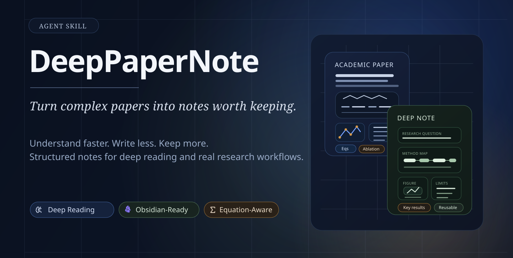
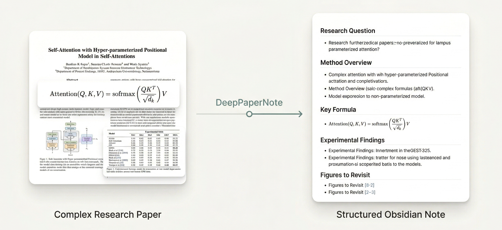

<div align="center">

# DeepPaperNote

**Turn a complex paper into an Obsidian note you will actually want to keep.**

[English](./README.md) | [简体中文](./README.zh-CN.md)

[](https://github.com/917Dhj/DeepPaperNote)
[](https://github.com/917Dhj/DeepPaperNote/releases/tag/v0.3.0-alpha)
[](./LICENSE)
[](./SKILL.md)
[](./references/obsidian-format.md)
[](./references/figure-placement.md)
[](./references/model-synthesis.md)
[](./CHANGELOG.md)

</div>



**Do you often run into this situation: you want to study a classic paper carefully, but the hardest part is no longer reading it — it is turning that reading into usable notes?** The real time sink usually looks like this:

- jumping back and forth between PDFs, Zotero, web pages, and your note app
- manually organizing metadata, abstracts, figures, and the method backbone
- understanding part of the paper, but still spending a long time turning that understanding into structured notes
- ending up with a note that looks complete but is not something you actually want to revisit later

DeepPaperNote is built for exactly that layer of repetitive, mechanical, but very expensive work. It takes over the gathering, structuring, figure placement, and note production work so you can keep your attention on actual thinking.

DeepPaperNote is a Codex skill for **deep paper reading**. It is not another tool that paraphrases the abstract and stops there. It cares about a harder set of questions:

- What problem is this paper actually solving?
- How does the mechanism really work?
- Are the key equations, experiments, and figure context preserved?
- Does the final note become something worth keeping in your long-term knowledge base?

Let scripts handle the repetitive work. Save your attention for actual thinking.

> [!tip]
> If you already have an Obsidian or Zotero workflow, DeepPaperNote is not trying to replace it. It is trying to automate the most tedious parts of evidence gathering, structuring, and note production.

## 🎯 What problems does it solve?



| 🎯 Your need / pain point | ✅ What DeepPaperNote does |
| --- | --- |
| You want to understand a complex paper faster | It organizes the method backbone, key results, figure context, and limitations into a note you can actually read through |
| You want to study a classic paper without handwriting a pile of mechanical notes | It handles metadata collection, structure building, figure placeholders, and full note generation so you can spend your energy on understanding |
| You want the paper to live inside Obsidian as a long-term asset | It files the paper into a domain-appropriate place inside your Obsidian knowledge base, then creates a paper-specific folder, Markdown note, and local `images/` directory |
| You already manage papers in Zotero and do not want to redo the work | It can prefer local records and attachments, reducing mismatches and often speeding the workflow up |
| You do not want another polished-looking summary | It leans toward mechanism breakdown, key numbers, formulas, edge cases, and honest limitations |

**In one sentence:**

> DeepPaperNote is a paper-reading-note workflow, not a paper-summary generator.

## ✨ How does it do that?

DeepPaperNote does not look more complete by simply rewriting the abstract in smoother prose. It raises note quality through a few workflow rules:

| 🧭 Core principle | 📝 What it means in practice |
| --- | --- |
| 🤖 Model-led understanding | The model is responsible for mechanism breakdown, method structure, key comparisons, and limitations instead of template-like summary writing. |
| 🗂️ Evidence first | It gathers evidence from PDFs, metadata sources, and optional Zotero workflows before writing, instead of producing claims first and looking for support later. |
| 🧪 Technical detail first | For technical papers, it tries to preserve key numbers, formulas, implementation logic, and real boundary conditions rather than stopping at high-level paraphrase. |
| 🖼️ Placeholder-first figures | When image extraction is unstable, it still keeps figure position, explanation, and context so the note structure does not break. |
| 🔗 Native knowledge-base output | It first routes the paper into a domain-appropriate place in your existing knowledge-base structure, then gives each paper its own folder, Markdown note, and `images/` directory. |
| 📚 Local-library-first resolution | If the paper already exists in Zotero, it can reuse local items and attachments, which is often both more reliable and faster. |

## 👀 Who It Is For

<table>
  <tr>
    <td valign="top" width="33%">
      <strong>👓 People studying hard or classic papers closely</strong><br><br>
      You are not reading papers just to skim the abstract and move on. You are reading papers with dense formulas, complex architectures, or layered experiments, and you want a note that actually untangles the method backbone, key results, and figure structure.
    </td>
    <td valign="top" width="33%">
      <strong>🗂️ People building a long-term Obsidian knowledge base</strong><br><br>
      You want paper notes to remain searchable, linkable, and reusable over time. DeepPaperNote files papers into a more suitable place based on their domain, then creates the Markdown note and <code>images/</code> folder so the result fits a real knowledge base.
    </td>
    <td valign="top" width="33%">
      <strong>🤖 People who want more than AI summaries</strong><br><br>
      You are not looking for a polished-looking recap. You want to know what the paper actually solves, how the method works, which results matter, and where the real limitations or misunderstandings are. DeepPaperNote aims closer to a research note than a summary generator.
    </td>
  </tr>
</table>

## 🚀 Quick Start

### 1) Install DeepPaperNote into your Codex skills directory

The recommended way is to download the latest [release](https://github.com/917Dhj/DeepPaperNote/releases) zip, extract it, and place the folder into your Codex skills directory:

For example, after downloading `DeepPaperNote-v0.3.0-alpha.zip`, you can unzip it and move the extracted folder to:

```bash
~/.codex/skills/DeepPaperNote-v0.3.0-alpha
```

Of course, you can also clone the source repository directly:

```bash
git clone https://github.com/917Dhj/DeepPaperNote.git ~/.codex/skills/DeepPaperNote
```

After installation, restart Codex so the skill is loaded.

### 2) Install the core Python dependency

Before your first real paper run, install the most important Python dependency:

```bash
python3 -m pip install PyMuPDF
```

Why this step matters:

- DeepPaperNote reads PDFs through `PyMuPDF`
- if `PyMuPDF` is missing, the core PDF extraction pipeline will not work

### 3) Start using it immediately

After that, just hand a paper to Codex. A title, DOI, URL, arXiv ID, or local PDF all work. Prompts like these are enough:

Typical prompts:

- `Generate a deep-reading note for this paper: Attention Is All You Need`
- `Turn this paper into an Obsidian note: https://arxiv.org/abs/1706.03762`
- `Read this PDF and produce a Markdown note with figure context`
- `Use DeepPaperNote on this paper: 10.48550/arXiv.1706.03762`

By default, DeepPaperNote writes the note in **Chinese**. At the moment, Chinese is the only note language that can fully benefit from the skill's current writing and linting rules. If you need English notes, please stay tuned for a future update.

By default, DeepPaperNote will:

- resolve the paper identity
- gather metadata and PDF evidence
- plan figure placeholders and attempt high-confidence figure replacement
- generate the final Markdown note
- save it into Obsidian when configured, or automatically fall back to the current directory

### 4) You do not need perfect setup on day one

You can try DeepPaperNote even if you have not finished configuring Obsidian, Zotero, or OCR yet.

If you want the Python dependencies for local development:

```bash
python3 -m pip install -e .
```

If you want to check the environment first, you can also ask Codex with short prompts such as:

- `/deeppapernote doctor`
- `/deeppapernote start`
- `查看 deeppapernote 的可用情况`
- `deeppapernote 有什么功能`

In that mode, DeepPaperNote should explain its capabilities, inspect the current setup, and tell you what is already configured or still missing.

If you want a more explicit onboarding prompt, see [ONBOARDING_PROMPT.md](./ONBOARDING_PROMPT.md).

## 🔧 Configuration (works out of the box, improves with setup)

Once you have PyMuPDF installed, you're ready to start generating notes with DeepPaperNote right away. The configurations outlined below are extensions of the core features, designed to help you seamlessly integrate the generated notes into your actual research workflow.

- if no Obsidian vault is configured, it can still save notes into the current working directory
- if you want an Obsidian-native long-term workflow, you should configure your vault path
- everything else in this section is optional and improves specific workflows

### Core setup: point DeepPaperNote to your Obsidian vault

The cleanest setup is:

```bash
export DEEPPAPERNOTE_OBSIDIAN_VAULT="/absolute/path/to/your/Obsidian_Documents"
```

If you want Codex to keep seeing this default configuration in future terminal sessions:

- on macOS / Linux, add it to your shell config such as `~/.zshrc`, then reload your shell (or Codex):

```bash
echo 'export DEEPPAPERNOTE_OBSIDIAN_VAULT="/absolute/path/to/your/Obsidian_Documents"' >> ~/.zshrc
source ~/.zshrc
```

- on Windows PowerShell, persist it as a user environment variable and then restart your terminal (or Codex):

```powershell
setx DEEPPAPERNOTE_OBSIDIAN_VAULT "C:\Users\YourName\Documents\Obsidian_Documents"
```

<details>
<summary><strong>🛠️ Show advanced configuration (directories / Zotero MCP / Semantic Scholar / OCR)</strong></summary>

### Directory-related settings

If you want to customize paper output paths or intermediate artifact paths:

```bash
export DEEPPAPERNOTE_PAPERS_DIR="Research/Papers"
export DEEPPAPERNOTE_OUTPUT_DIR="tmp/DeepPaperNote"
```

| ⚙️ Variable | Required | 📝 Purpose |
| --- | --- | --- |
| `DEEPPAPERNOTE_OBSIDIAN_VAULT` | Recommended | Root path of your Obsidian vault |
| `DEEPPAPERNOTE_PAPERS_DIR` | Optional | Vault-relative paper output folder, default: `Research/Papers` |
| `DEEPPAPERNOTE_OUTPUT_DIR` | Optional | Local temporary artifact directory, default: `tmp/DeepPaperNote` |
| `DEEPPAPERNOTE_WORKSPACE_OUTPUT_DIR` | Optional | Fallback output folder under the current working directory when no Obsidian vault is configured, default: `DeepPaperNote_output` |

If you want Codex to keep using these values by default:

- on macOS / Linux, add them to your `~/.zshrc` as well:

```bash
echo 'export DEEPPAPERNOTE_PAPERS_DIR="Research/Papers"' >> ~/.zshrc
source ~/.zshrc
```

- on Windows PowerShell, persist them as user environment variables:

```powershell
setx DEEPPAPERNOTE_PAPERS_DIR "Research/Papers"
```

Why the optional path settings can help:

- `DEEPPAPERNOTE_PAPERS_DIR`
  Useful if your vault does not store papers under `Research/Papers`, or if you want DeepPaperNote to fit an existing folder convention without extra manual moves.
- `DEEPPAPERNOTE_OUTPUT_DIR`
  Useful if you want all intermediate artifacts in a predictable location for debugging, cleanup, or experimentation.

### Optional: Zotero MCP for local-library-first workflows

DeepPaperNote can work without Zotero.
But if you want Codex to search your local Zotero library first, you should configure a Zotero MCP option that Codex can actually use.

This is most worth setting up if you already use Zotero as your main paper-management or reading workflow.

Recommended ways to think about it:

| 🧩 Option | 🎯 Best for | 📝 Notes |
| --- | --- | --- |
| [kujenga/zotero-mcp](https://github.com/kujenga/zotero-mcp) | Lightweight read access | Closer to a minimal Zotero MCP server for search, metadata, and text access, but not natively designed for Codex, so it usually still needs some adaptation |
| [54yyyu/zotero-mcp](https://github.com/54yyyu/zotero-mcp) | Richer research workflow features | More feature-rich, but also not natively built for Codex, so using it well in Codex usually requires additional adaptation |

Why it matters:

- local Zotero hits are usually the best identity anchor
- if the paper is already in your local Zotero library, DeepPaperNote can often reuse local records and attachments instead of searching and downloading again, which also tends to make note generation faster
- Codex can prefer your local paper library before internet search
- local attachments can reduce wrong-title matches
- it is especially helpful when you already curate papers in Zotero and do not want DeepPaperNote to rediscover the same paper from weaker web matches
- it also improves reliability for published papers whose title may collide with preprints, workshop versions, or mirrored pages

Important note:

- DeepPaperNote does **not** require one specific Zotero MCP implementation
- for DeepPaperNote, the key capability is that Codex can search Zotero items, inspect metadata, and ideally read local full text
- the two routes above are **not** plug-and-play Codex-native options today, so stable use in Codex usually requires some adaptation on your side

### Optional: Semantic Scholar API key

This is not required, but if you have a Semantic Scholar API key you can expose it as:

```bash
export DEEPPAPERNOTE_SEMANTIC_SCHOLAR_API_KEY="your_api_key"
```

Why it can help:

- metadata lookup is usually more stable when Semantic Scholar is available
- title-based paper resolution can be more reliable for hard-to-match papers
- author, venue, and abstract backfill may be more complete in some cases
- it gives DeepPaperNote one more strong source before falling back to weaker guesses

### Optional: OCR tooling for scanned PDFs

OCR is not required for many modern PDFs.
But it becomes useful when a paper is:

- a scanned PDF
- an image-based PDF with poor embedded text
- an older paper where direct text extraction is incomplete

Why DeepPaperNote uses OCR:

- to recover page text when direct PDF extraction is too weak
- to preserve method and results evidence that would otherwise be lost
- to improve page-level context around figures and captions

Current OCR logic in DeepPaperNote:

- DeepPaperNote first tries normal PDF text extraction with `PyMuPDF`
- for each page, it counts how much searchable text was extracted
- if a page has too little extracted text, it becomes an OCR fallback candidate
- OCR is then applied to that page only
- the recovered OCR text is mainly used as page context for later evidence handling and figure/page semantic matching

Important scope note:

- OCR is currently a **page-text fallback**
- it is **not** the primary extraction path for all PDFs
- it is **not** used as a replacement for model-side understanding
- it is **not** used to "understand images" directly

Without OCR, DeepPaperNote still works well on normal digital PDFs, but scanned or low-quality PDFs may produce weaker evidence.

Required software and packages for OCR:

| 🧱 Layer | 📦 Requirement | 📝 Purpose |
| --- | --- | --- |
| System tool | `tesseract` | The actual OCR engine |
| Python package | `pytesseract` | Python bridge to `tesseract` |
| Python package | `Pillow` | Opens rendered page images before OCR |

Install on macOS:

```bash
brew install tesseract
python3 -m pip install --user pytesseract Pillow
```

Install on Windows:

```powershell
winget install UB-Mannheim.TesseractOCR
py -m pip install --user pytesseract Pillow
```

If `winget` is unavailable, install Tesseract OCR manually and then run:

```powershell
py -m pip install --user pytesseract Pillow
```

Quick verification:

```bash
tesseract --version
python3 -c "import pytesseract, PIL; print('python_ok')"
python3 -c "import pytesseract; print(pytesseract.get_tesseract_version())"
```

</details>

## 📝 Changelog Preview

For release-level updates, see [CHANGELOG.md](./CHANGELOG.md).

| 🏷️ Version | 🚦 Status | ✨ Highlights |
| --- | --- | --- |
| v0.3.0-alpha | ✅ Released | Major quality upgrade: dedicated innovation section, explicit mechanism flow, stronger workflow discipline, final readability review, math syntax gate, and the new `Original Abstract Translation` front-matter block |
| v0.2.0-alpha | ✅ Released | Replication-oriented note-writing upgrade: explicit `note_plan`, equation-aware output, stricter final self-review, bilingual abstract handling, and stronger formatting checks |
| v0.1.0-alpha | ✅ Released | First public alpha: Codex workflow, synthesis bundle pipeline, Zotero-first helpers, placeholder-first figure handling, workspace fallback, OCR fallback, tests, and CI |
| Unreleased | 🕒 No new release-level changes yet | There are currently no additional public release notes beyond v0.3.0-alpha |

## ⚙️ Workflow

The default path is:

1. resolve the paper identity
2. collect metadata
3. fetch a PDF or enough full-text evidence
4. extract evidence
5. extract PDF image assets
6. plan figure positions
7. build a synthesis bundle
8. let Codex/GPT write the note
9. lint the final note
10. write it into Obsidian

Core principle:

- scripts gather evidence
- the model understands and writes
- linting is the final gate before saving

Related docs:

- [Workflow](./references/workflow.md)
- [Architecture](./references/architecture.md)
- [Model Synthesis](./references/model-synthesis.md)

## 🖼️ Figure Strategy

When figure handling breaks down, the quality of the whole note usually drops with it.

That is why DeepPaperNote uses a more structure-first, placeholder-first figure strategy:

- keep the semantic place of important figures inside the note
- avoid breaking the reading flow when extraction is incomplete
- show which figure belonged there and why it matters, so you can later revisit the paper and add the image yourself if needed

Recommended placeholder format:

```md
> [!figure] Fig. 3 Data Distribution and Quality Evaluation
> Suggested location: Data and task definition
> Why here: This figure combines sample composition, conversation-length statistics, and expert quality checks, making it one of the most important figures for understanding the data boundaries.
> Current status: Placeholder kept; current extraction only recovered partial subpanels and cannot yet reconstruct the full original figure reliably.
```

In other words, DeepPaperNote prioritizes:

> note completeness and readability over forcing every figure to be extracted automatically at any cost

See [figure placement rules](./references/figure-placement.md).

## ✅ Quality Bar

DeepPaperNote has a concrete bar for what counts as a usable note.

The final note should:

- clearly separate the research question and the task definition
- explain the real method or analytical pipeline
- capture the numbers that actually matter
- point out where the paper is easiest to misread
- include at least one honest limitation
- use real heading structure: `#`, `##`, `###`
- avoid mixed Chinese-English prose in the body

If the evidence is not strong enough, the workflow should degrade gracefully or fail instead of pretending that a deep reading note is complete.

Related docs:

- [Evidence First](./references/evidence-first.md)
- [Deep Analysis](./references/deep-analysis.md)
- [Note Quality](./references/note-quality.md)
- [Final Writing](./references/final-writing.md)
- [Figure Placement](./references/figure-placement.md)

## 🗂️ Repository Layout

```text
DeepPaperNote/
├── SKILL.md
├── README.md
├── README.zh-CN.md
├── CHANGELOG.md
├── LICENSE
├── ONBOARDING_PROMPT.md
├── pyproject.toml
├── agents/
│   └── openai.yaml
├── assets/
│   ├── hero-academic.svg
│   ├── hero.png
│   └── note_template.md
├── references/
│   ├── architecture.md
│   ├── deep-analysis.md
│   ├── evidence-first.md
│   ├── figure-placement.md
│   ├── final-writing.md
│   ├── metadata-sources.md
│   ├── model-synthesis.md
│   ├── note-quality.md
│   ├── obsidian-format.md
│   ├── paper-types.md
│   └── workflow.md
└── scripts/
    ├── build_synthesis_bundle.py
    ├── collect_metadata.py
    ├── common.py
    ├── contracts.py
    ├── create_input_record.py
    ├── extract_evidence.py
    ├── extract_pdf_assets.py
    ├── fetch_pdf.py
    ├── lint_note.py
    ├── locate_zotero_attachment.py
    ├── materialize_figure_asset.py
    ├── plan_figures.py
    ├── resolve_paper.py
    ├── run_pipeline.py
    └── write_obsidian_note.py
```

## 🧰 Recommended Environment

| 🧰 Component | 🚦 Status | 📝 Notes |
| --- | --- | --- |
| Codex desktop / CLI | Recommended | Primary target environment today |
| Python 3.10+ | Required | Runs the helper scripts |
| PyMuPDF | Required | Core PDF dependency; install it with `python3 -m pip install PyMuPDF` |
| Local Obsidian vault | Recommended | Writes directly into a long-term note system; otherwise falls back to the current working directory |
| Zotero + MCP | Optional | Helpful for local-library-first paper workflows |
| OCR tools | Optional | Improves handling of scanned PDFs |

## 🧭 Design Principles

The core judgment behind DeepPaperNote is simple:

1. **A good paper note is not just a paragraph-style summary.**

A useful note should help you understand:

- how the method works
- where the evidence comes from
- what the experiments actually show
- what the real boundaries and limitations are

2. **The goal of paper reading is a reusable research asset.**

Not just “I kind of get it right now,” but something you can revisit, cite, and build on later.

3. **Note generation should serve a real research workflow.**

That is why it is designed to fit naturally with:

- Obsidian
- Zotero
- local paper management
- long-term knowledge-base building

## 🧭 Inspirations

DeepPaperNote was influenced by projects that take paper reading, evidence extraction, and note generation seriously, especially:

- [heleninsights-dot/phd-deepread-workflow](https://github.com/heleninsights-dot/phd-deepread-workflow)
- [juliye2025/evil-read-arxiv](https://github.com/juliye2025/evil-read-arxiv)

## 📄 License

This project is licensed under the [MIT License](./LICENSE).
