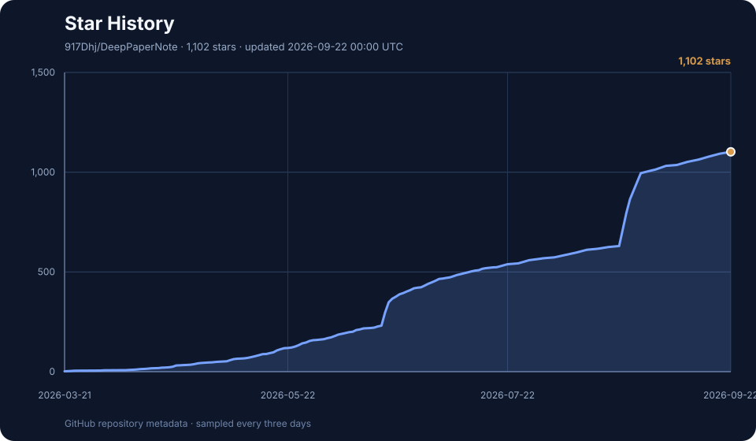

<div align="center">

# DeepPaperNote

**把一篇复杂论文，变成一篇真正值得长期保留的 Obsidian 笔记。**

[English](./README.md) | [简体中文](./README.zh-CN.md)

[](https://917dhj.github.io/DeepPaperNote/)
[](https://github.com/917Dhj/DeepPaperNote)
[](https://github.com/917Dhj/DeepPaperNote/releases)
[](./LICENSE)
[](./skills/deeppapernote/SKILL.md)
[](./skills/deeppapernote/references/obsidian-format.md)
[](./CHANGELOG.md)

</div>

[](https://917dhj.github.io/DeepPaperNote/)

<p align="center">
  <em>深读一篇论文，沉淀一页学术 Wiki。</em>
</p>

**你是否经常遇到这种情况：准备精读一篇重要论文时，最累的往往不是“看”，而是把已经理解的内容整理成以后还能真正使用的笔记？** 时间通常消耗在这些环节：

- 在 PDF、Zotero、网页和笔记软件之间来回切换
- 手动整理元数据、摘要、图表和方法主线
- 明明已经读懂了一部分，却还要花很长时间把理解写成结构化笔记
- 最后留下的仍然只是一篇“看起来完整，但以后未必还想回看”的笔记

DeepPaperNote 想解决的，就是这一层重复、机械、但又非常耗时的工作。它会接管材料收集、结构整理、图表定位和笔记成形这些环节，让你把精力留给论文真正值得思考的部分。

换句话说，你可以把 DeepPaperNote 看作 **LLM 学术 Wiki 的单篇论文入口**：它每次把一篇论文读深，将研究问题、方法、证据、结果和图表沉淀为一页可供人阅读、也可被 Agent 继续使用的学术知识页面。Obsidian 负责承载、链接和长期积累这些页面，DeepPaperNote 则负责把论文可靠地送进去。

DeepPaperNote 是一个专注于**一次精读一篇论文**的 Agent Skill。同一套核心 skill 可以运行在 Claude Code 和 Codex 上，它更关心那些真正区分“深度笔记”和“摘要改写”的问题：

- 论文到底在解决什么问题？
- 方法、系统或分析机制究竟是怎样工作的？
- 关键公式、实验结论和图表语境是否被保留下来？
- 最终结果能否沉淀成一篇适合长期积累的 Obsidian 笔记，而不是一次性摘要？

> [!tip]
> 如果你已经有自己的 Obsidian 或 Zotero 工作流，DeepPaperNote 会把最耗时、也最容易出错的取证、整理和成稿环节自动化。

## 📰 最新动态

- **[2026-07-16]** 🧩 新增可选 companion skill [`paper-glossary`](./skills/paper-glossary/README.md)，用于构建可复用的 Obsidian 术语笔记。
- **[2026-07-16]** 🔌 DeepPaperNote 现在以支持多个 Agent 的插件形式分发，并支持从仓库中选择多个 skill。[PR #12](https://github.com/917Dhj/DeepPaperNote/pull/12)
- **[v2.0.0]** 🚀 发布更深入的证据优先论文精读流程，并加强笔记规划与图表处理。[版本说明](https://github.com/917Dhj/DeepPaperNote/releases/tag/v2.0.0)

这里只保留最近三条用户可感知的重要动态。完整历史请查看 [CHANGELOG](./CHANGELOG.md) 与 [GitHub Releases](https://github.com/917Dhj/DeepPaperNote/releases)。

## 🚀 快速开始

### 1. 安装插件

```bash
npx skills add 917Dhj/DeepPaperNote
```

安装程序会让你选择需要安装的 skill，以及要安装到哪些 Agent。大多数用户可以先选择 `deeppapernote`；只有需要可复用术语笔记时，再选择 `paper-glossary`。

### 2. 安装核心 PDF 依赖

```bash
python3 -m pip install PyMuPDF
```

DeepPaperNote 需要 Python 3.10 或更高版本。核心 PDF 抽取路径依赖 `PyMuPDF`。

### 3. 把论文交给 Agent

论文标题、DOI、URL、本地 PDF 都可以直接作为输入；也支持 arXiv ID，在具备兼容集成时还支持 Zotero 条目。

```text
给这篇论文生成深度笔记：<论文标题、DOI、URL、arXiv ID 或本地 PDF>
把这篇论文整理成 Obsidian 笔记：<论文>
```

DeepPaperNote 完整支持英文和简体中文笔记结构。如果当前进程继承的 `DEEPPAPERNOTE_*` 环境变量已经完整，运行时不会读取 `~/.deeppapernote/config.json`；否则 Agent 才把该文件作为 fallback，并只询问仍未解析的字段。
下方“用户配置”统一说明两种保存模式、两套语言 Profile 与单次覆盖方式。章节名称、元数据字段、图表占位、规划规则、校验与 Formal Save 都会遵循解析后的语言。

## 🎯 为什么选择 DeepPaperNote？


| 你可能正遇到…… | DeepPaperNote 会帮你…… |
| --- | --- |
| 📄 **论文读完了，但笔记还是一堆散乱片段** | 把研究问题、方法链路、核心实验和局限重新组织成一篇真正能够再次读懂的笔记 |
| 🧠 **不想再收藏一篇“看起来很完整”的 AI 摘要** | 保留真正重要的公式、数字、图表语境和证据边界，让笔记承载真实理解 |
| 🗂️ **论文越读越多，却始终没有形成自己的学术 Wiki** | 把每篇论文沉淀为可搜索、可链接、可长期复用的 Obsidian 知识页面，让你的学术 Wiki 逐篇生长 |
| 📚 **Zotero 里已经有论文，不想重新下载和匹配** | 在可用时优先复用本地条目和附件，减少重复工作与论文错配 |

## 🧩 Skills

DeepPaperNote 仍然是唯一主产品。仓库同时提供一个可选 companion skill；它只使用 DeepPaperNote 已保存的论文材料，不会接管或重新运行论文精读流程。

| Skill | 定位 | 什么时候使用 |
| --- | --- | --- |
| [`deeppapernote`](./skills/deeppapernote/SKILL.md) | **核心产品 · 推荐安装** | 精读单篇论文，生成包含图表、关键结果与局限的结构化、证据充分的 Obsidian 笔记 |
| [`paper-glossary`](./skills/paper-glossary/SKILL.md) | 可选 companion | 从已有论文材料中筛选术语，创建可复用的 Obsidian 术语笔记，并按需链接回论文笔记 |

你不需要一次安装所有 skill。安装时选择适合自己工作流的部分即可。

## ✅ 质量承诺

- 最终结果应该是一篇单篇论文深度笔记，而不是摘要改写。
- 重要的方法、实验结果、图表和局限应该得到解释，而不只是被罗列出来。
- 如果现有来源不足以支撑真正的深度精读，流程应该停止并要求更好的材料，而不是假装笔记已经完成。

规范执行契约以 [`skills/deeppapernote/SKILL.md`](./skills/deeppapernote/SKILL.md) 为准。

## 🗂️ 用户配置

DeepPaperNote 可以完全使用当前进程环境变量运行；也可以在 `~/.deeppapernote/config.json` 中保存可选的设备本地长期偏好，作为 fallback 和明确的未来默认值。

| 字段 | 有效值 | 何时必填 |
| --- | --- | --- |
| `output_language` | `zh-CN` 或 `en` | 始终必填 |
| `save_mode` | `workspace` 或 `obsidian` | 始终必填 |
| `obsidian_vault` | 已存在的绝对目录 | 仅 `obsidian` 模式 |
| `papers_dir` | Vault 内安全的相对路径 | 仅 `obsidian` 模式 |

英文 workspace 配置只需要两个始终必填的字段：

```bash
export DEEPPAPERNOTE_OUTPUT_LANGUAGE=en
export DEEPPAPERNOTE_SAVE_MODE=workspace
```

等价的可选 User Configuration 是：

```json
{
  "output_language": "en",
  "save_mode": "workspace"
}
```

简体中文 Obsidian 配置还要给出 Vault 与论文目录：

```bash
export DEEPPAPERNOTE_OUTPUT_LANGUAGE=zh-CN
export DEEPPAPERNOTE_SAVE_MODE=obsidian
export DEEPPAPERNOTE_OBSIDIAN_VAULT="/你的/Obsidian/Vault/绝对路径"
export DEEPPAPERNOTE_PAPERS_DIR="Research/Papers"
```

等价的可选 User Configuration 是：

```json
{
  "output_language": "zh-CN",
  "save_mode": "obsidian",
  "obsidian_vault": "/你的/Obsidian/Vault/绝对路径",
  "papers_dir": "Research/Papers"
}
```

配置会在论文身份解析等昂贵步骤之前完成。DeepPaperNote 会先解析显式请求、CLI 参数和当前进程环境变量；如果它们已经构成完整合法的配置，就不读取 User Configuration。否则才读取 `config.json` 作为 fallback，并通过一个 Configuration Prompt Batch 只询问仍未解析的字段；fallback 文件不可读时会失败关闭。

当前进程环境变量是正式的 Run Override，不会改写可选配置文件。只有当继承的变量不完整且 `config.json` 不存在时，shell 启动文件才会作为迁移候选；确认后才写入长期偏好。Preference Change 会保留未知（unknown）JSON 字段；替换畸形 JSON 前会先备份，并且必须得到确认。

### Run Override 与 Preference Change

每次运行都按以下固定优先级解析：

`explicit request > CLI > current process environment > User Configuration`

- “这篇论文仅本次用英文生成”是 Run Override，`config.json` 保持逐字节不变。
- “这篇论文仅本次用中文生成”是对应的 `zh-CN` Run Override。
- “以后默认生成英文笔记”是 Preference Change，确认后才修改未来默认值。
- CLI 选项 `--language`、`--save-mode`、`--vault`、`--papers-dir` 都是 Run Override。例如：

```bash
python3 skills/deeppapernote/scripts/run_pipeline.py --input '<paper>' --language en --save-mode obsidian --vault /absolute/path/to/vault --papers-dir Research/Papers
```

workspace 模式本次不会使用 `obsidian_vault` 与 `papers_dir`，但会保留这些偏好，供以后 Obsidian 运行继续使用。Run Override 不会自动变成 Preference Change。

### 输出语言 Profile 与 Formal Save

- `zh-CN` 依次使用 `核心信息`、`原文摘要翻译`、`创新点`、`一句话总结`、`研究问题`、`数据与任务定义`、`方法主线`、`关键结果`、`深度分析`、`局限`、`我的笔记`、`引用`；方法部分使用 `机制流程`。图表 callout 使用 `建议位置：`、`放置原因：`、`当前状态：`，真实图片说明以 `论文原图编号：` 开头。
- `en` 依次使用 `Core Information`、`Abstract`、`Contributions`、`One-Sentence Summary`、`Research Question`、`Data and Task Definition`、`Method`、`Key Results`、`Deep Analysis`、`Limitations`、`Research Notes`、`References`；方法部分使用 `Mechanism Flow`。图表 callout 使用 `Suggested location:`、`Why it matters:`、`Current status:`，真实图片说明以 `Original paper item:` 开头。

两种 Profile 的 Abstract 都必须忠实呈现原论文摘要，并使用请求的输出语言；后续创新点和结果解释留在后续章节。同一个 canonical Skill 与一条流水线（one pipeline）会把选定语言一直绑定到 lint 和 Formal Save。

Formal Save 会把 Markdown 笔记与 paper-local `images/` 目录写入选定的 workspace 或 Obsidian 目标。即使没有插入图片，`images/` 仍属于论文保存布局。保存受阻时会报告原目标，不会静默切换模式。

## 🔧 可选增强

处理普通数字版 PDF 时，下面这些能力都不是必需项。

| 可选增强 | 能解决什么问题 |
| --- | --- |
| Zotero 集成 | 联网搜索前优先复用本地论文条目与 PDF 附件 |
| Semantic Scholar API | 改善部分难以识别论文的元数据获取 |
| OCR 工具 | 从扫描版或文本质量较差的 PDF 中恢复页面文字 |

### Zotero Local API

内置的只读 Zotero Local API 集成提供三种解析模式：

- `auto`（默认）：优先使用唯一的本地条目，同时保留联网回退
- `off`：跳过 Zotero 查询
- `required`：只有 Zotero 唯一解析出目标论文时才继续

本地匹配存在歧义时，流程会明确失败，而不是任意选择条目。Agent runtime 或 MCP 提供的兼容集成仍可作为可选替代路线。

实际需要其中某项能力时，可以让 Agent 检查当前环境，并针对这台机器引导配置。

## 🧭 致谢与灵感

DeepPaperNote 在工作流设计上受到了一些认真对待论文阅读、证据提取与笔记生成的项目启发，尤其是：

- [heleninsights-dot/phd-deepread-workflow](https://github.com/heleninsights-dot/phd-deepread-workflow)
- [juliye2025/evil-read-arxiv](https://github.com/juliye2025/evil-read-arxiv)

## 🤝 贡献说明

请将 Pull Request 提交到 `develop`，而不是 `main`。可能影响最终笔记质量的改动，应使用 [`evals/regression-workflow-zh.md`](./evals/regression-workflow-zh.md) 与 [`evals/note-quality-rubric.md`](./evals/note-quality-rubric.md) 进行评估。

## Star History

[](https://www.star-history.com/?repos=917Dhj%2FDeepPaperNote&type=date&legend=top-left)

<p align="center">
  <em>感谢你阅读、使用和支持 DeepPaperNote。愿你的每一次论文精读，都更清晰、更从容，也更有收获。</em>
</p>

<p align="center">
  <a href="./LICENSE">MIT License</a> &copy; <a href="https://github.com/917Dhj">917Dhj</a>
</p>
